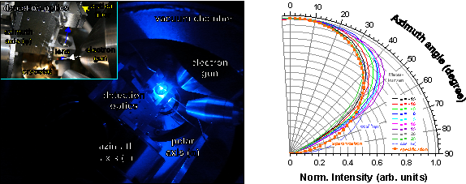

### 2014 – 2016 Nitride ultra-violet surface emitting laser
Intended to an emission wavelength of 270 nm in the UV-C spectral range Distributed Bragg reflectors (DBRs) and microcavity lasers qualified to operate in the weak or strong light matter coupling regime were fabricated. After the design and simulation, structures based on Aluminum-Nitride (AlN) and the ternary alloy Aluminum-Gallium-Nitride (AlGaN) were grown using metal organic vapor phase deposition. High reflectance Bragg mirrors, hybrid and monolithic epitaxial microcavities were achieved by applying strain engineering schemes and the development of a new patented method of polarity controlled growth. Final structures were characterized facilitating structural (X-ray diffraction, atomic force microscopy, scanning electron microscopy) and optical (Photorefelctometry, photoluminescence) measurement techniques. Based on the achieved improvements on the AlGaN crystalline quality and monolayer precise epitaxy of DBR and QW nanostructures concepts for the fabrication of ultra-low threshold UV-C polariton laser devices were demonstrated.

### 2013 – 2014 Optical properties of nitride/oxide LED devices and semiconductor nanostructures
The emission characteristics of nitride and oxide based nanostructures were investigated using highly spatial, spectral and time resolved photoluminescence spectroscopy at variable temperatures between 2.9 K and room temperature and under the influence of strong magnetic fields. In close collaboration to a leading optoelectronic company and university institutions micrometer size structured Indium-Gallium-Nitride arrays and quantum well emitters were optimized to enhance the light output efficiency of nitride light emitting diodes. Furthermore, the fundamental doping behavior of Zinc-oxide nanostructures was investigated. Detailed inside into the dopant incorporation in the host crystal and donor type identification was gained by combining structural and luminescence measurement techniques and magnetic field dependent spectroscopy. 

### 2007 – 2013 Light-matter coupling in nitride surface emitting devices 
To investigate the fundamental interaction of phonons with matter vertical emitting microcavity structures were designed, fabricated and analyzed. An unambiguous identification of photon lasing and the emission signature of polaritons, quasiparticles formed after a strong interaction of photons and matter, was possible by establishing the novel angle resolved cathodoluminescent characterization methode. The use of electrons for the excitation of the nitride microcavity structures guarantees an efficient pumping of the lasing medium with nanometer resolution combined with ability to probe the emission characteristic over a broad solid angle (image below). The emission distribution of various optoelectronic devices and samples to university research was analyzed. Results were entered into the optimization of microcavity lasers to achieve the weak and strong coupling regime. Signatures of polariton emission in Gallium-nitride and Indium-Gallium-Nitride-microcavity structures were observed in specially build lasers and sampled received from various international collaborations. 

 
*Azimuthal emission distribution of a commercial blue LED for different polar angles (left) and dispersion relation of a Gallium-Nitride microcavity sample with Aluminum-Indium-Nitride/ Gallium-Nitride bottom and dielectric top Bragg mirrors (right).*
