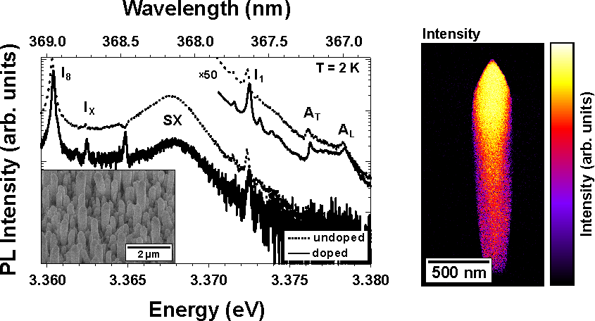

### 2014 – 2016 Nitride ultra-violet surface emitting laser
Intended to an emission wavelength of 270 nm in the UV-C spectral range Distributed Bragg Reflectors (DBRs) and microcavity lasers qualified to operate in the weak and strong light matter coupling regime were fabricated. After the design and simulation, structures based on Aluminum-Nitride (AlN) and the ternary alloy Aluminum-Gallium-Nitride (AlGaN) were grown using metal organic vapor phase deposition. High reflectance Bragg mirrors, hybrid and monolithic epitaxial microcavities were achieved by applying strain engineering schemes and the development of a new patented method of polarity controlled growth. Final structures were characterized facilitating structural (X-ray diffraction, atomic force microscopy, scanning electron microscopy) and optical (photoreflectometry, photoluminescence) measurement techniques. Based on the achieved improvements of the AlGaN crystalline quality and the monolayer precise controlled epitaxy of DBR and QW nanostructures concepts for the fabrication of ultra-low threshold UV-C polariton laser devices were demonstrated.
  

   
*Spatial resolved reflectance characteristic of a 20.5 pair Aluminum-Nitride/ Aluminum-Gallium-Nitride Bragg reflector (inset of left image) along the radius of a two inch wafer (left). An electron microscopy image of a hybrid nitride microcavity structure qualified to show weak and strong light-matter coupling is depicted in the right image. It’s composed of an epitaxial grown Aluminum-Nitride/ Aluminum-Gallium-Nitride bottom and dielectric top Bragg mirror surrounding an Aluminum-Gallium-Nitride cavity layer.*
  
          
### 2013 – 2014 Optical properties of nitride/oxide LED devices and semiconductor nanostructures
The emission characteristics of nitride and oxide based nanostructures were investigated using highly spatial, spectral and time resolved photoluminescence spectroscopy at variable temperatures between 2.9 K and room temperature and under the influence of strong magnetic fields. In close collaboration to a leading optoelectronic company and university institutions micrometer size structured Indium-Gallium-Nitride arrays and quantum well emitters were optimized to enhance the light output efficiency of nitride light emitting diodes. Furthermore, the fundamental doping behavior of Zinc-Oxide nanostructures was investigated. Detailed inside into the dopant incorporation in the ZnO host crystal and donor type identification was gained by combining structural and luminescence measurement techniques and magnetic field dependent spectroscopy. 
  

  
*Highly spectral resolved emission spectra of doped and undoped Zinc-Oxide nanowires (left). The sample morphology investigated by electron microscopy is shown in the inset of the left image. The emission distribution across a single nanowire indicate dominant emission originating from the nanowire tip (right image).*
  
     
### 2007 – 2013 Light-matter coupling in nitride surface emitting devices 
To investigate the fundamental interaction of photons with matter vertical emitting microcavity structures were designed, fabricated and analyzed. An unambiguous identification of photon lasing and the emission signature of polaritons, quasiparticles formed after a strong interaction of photons and matter, was possible by establishing a novel angle resolved cathodoluminescence characterization method. The setup guarantees an efficient electron pumping of the lasing medium through the resonator of microcavity lasers with nanometer resolution, combined with the ability to probe the emission characteristic of arbitrary photonic structures over a broad solid angle (image below). Results were entered into the optimization of microcavity lasers to achieve the weak and strong coupling regime. Signatures of polariton emission in Gallium-Nitride and Indium-Gallium-Nitride-microcavity structures were observed in self-fabricated lasers and sampled received from various international collaborations.   
  
 
  
*View into the vacuum chamber of a new established angle resolved cathodoluminescence characterization tool tailored for the analysis of microcavity samples and optoelectronic devices (left). The azimuthal emission distribution of a commercial blue LED measured for different polar angles w recorded by using the angle resolved cathodoluminescence setup is shown in the right image.*
